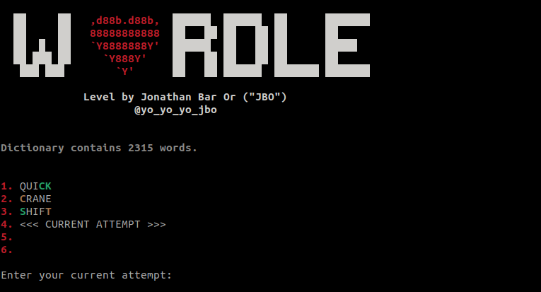

# Terminal Wordle challenge
An interesting Linux challenge exploiting a [Wordle](https://en.wikipedia.org/wiki/Wordle) terminal implementation running as a SUID binary.


## Setup
The setup should consist of the flag, a file [dictionary.txt](dictionary.txt) and the binary `wordle` installed as a SUID binary.  
To compile, simply run:

```shell
sudo ./compile.sh
```

The reader is strongly encouraged to solve on their own before reading the solution, which I will be describing here.
